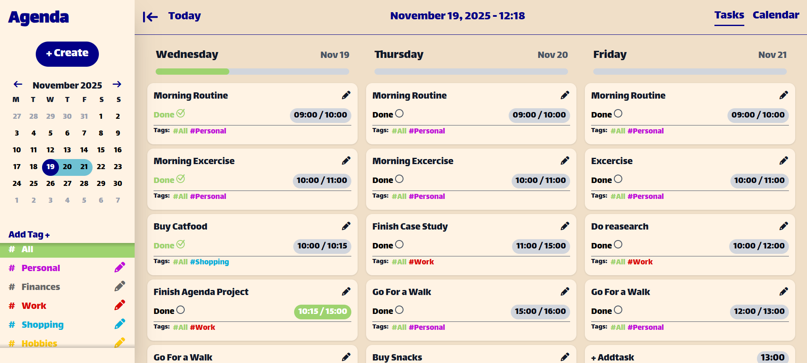
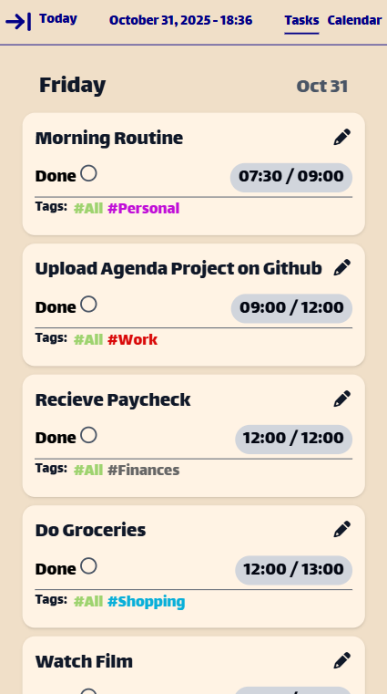

# 📒 Agenda
A modern, responsive daily agenda built with React, Vite, and Tailwind CSS. Supports task creation, editing, filtering by tags, and a calendar view. Designed to be elegant and functional on both desktop and mobile.
<p align="center">
<a href= "https://github.com/bedirhanozcan978/Agenda/blob/main/LICENSE"></a>


</p>

## 🙏 Thank You!
Please ⭐️ this repo and share it with others

## 📸 Screenshots

<table>
  <tr>
    <th> Desktop View </th>
    <th> Mobile View </th>
  </tr>
  <tr>
    <td>  </td>
    <td>  </td>
  </tr>
</table>

## 📹 Gifs

<table>
  <tr>
    <th> Desktop View </th>
    <th> Mobile View </th>
  </tr>
  <tr>
    <td>  </td>
    <td>  </td>
  </tr>
</table>

## 🛠 Tech Stack
        

## ✨ Features
* Modern UI
* Responsive Design
* Smooth interactions and intuitive UX
* Local Storage Saving
* Full Create, Read, Update, Delete(CRUD) Functionality
* Tag Filtering

## 🚀Getting Started
Clone this repository using:
```
git clone https://github.com/bedirhanozcan978/Agenda.git
```

Navigate into the repository using:
```
cd Agenda
```

Install dependencies and run locally:
```
npm install
npm run dev
```

Open in browser
```
http://localhost:5173/
```
